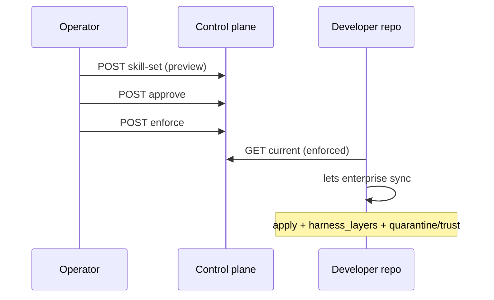

# Enterprise distribution (PRD-048)

How **org-only** skill distribution relates to artifacts in `skill-overlay` and what
remains open for full product closure.

Canonical feature workspace:
`ground-truth/features/prd-048-enterprise-skill-distribution-and-enforcement/`

LAEM bridge (waves): `ground-truth/features/prd-048-.../delivery/laem-bridge.md`

## Principle

- **Metadata only** on control-plane — no remote execution, no raw prompt hosting.
- **Local verification and apply** in `core` — hashes and signatures are authority.
- **Single harness schema** — enterprise payloads use `harness_layers[]`, not a parallel format.

## Lifecycle (operator)

**Evidenced (AC-5):** integration test
`core/tests/integration/test_enterprise_lifecycle_sync_e2e.py` and
`core/scripts/verify-enterprise-lifecycle-smoke.sh` ([#427](https://github.com/letsbe10x/core/pull/427)).

## Relationship to skill-overlay

| skill-overlay | Enterprise |
|---------------|------------|
| Public first-party **presets** | Optional reference in `harness_layers` or skill-set `artifacts` |
| Legacy **overlay.toml** | Not deployed via enterprise JSON — migrate to presets |
| MIT examples | Org copies manifest shape for **private** repos |

Enterprise skill sets reference **pinned portable artifacts** (skills, bundles) by
`artifact_id` + `content_hash`, not mutable remote strings.

## Program status (2026-05-31)

| Area | Status | Notes |
|------|--------|-------|
| LAEM bridge W2–W4 | **Done** | Harness in payloads, status CLI, CP UI, fleet CSV |
| AC-5 lifecycle | **Evidenced** | preview → approve → enforce → `lets enterprise sync` |
| AC-1..4 | **in_progress** | Portable provenance everywhere; run effective-policy UX; tightening proofs |
| AC-6 | **Partial** | CLI + admin UI; not all fleet surfaces show full provenance |
| gap-ig-011 | **mitigated** | Operator visibility, quarantine on all apply paths, §14 CI template |
| Overlay migration | **Open** | ~19 legacy `overlay.toml`; 3 LAEM presets here |
| §14 policy | **Partial** | `lets harness verify --policy`; no mandatory customer CI template |

**Summary:** Engine and enterprise lifecycle work. Full closure (every AC evidenced,
all overlays → presets, mandatory org CI) is not done.

## Acceptance criteria map

| ID | Theme | Status |
|----|-------|--------|
| AC-048-LAEM-1..3 | LAEM substrate | evidenced (PRD-193) |
| AC-5 | Lifecycle + quarantine + rollback API | evidenced |
| AC-6 | Inspect config, diffs, CLI + UI | in_progress |
| AC-1 | Pinned portable artifacts + provenance | in_progress |
| AC-2 | Enforced vs optional + break-glass | in_progress |
| AC-3 | Tightening-only enterprise policy | in_progress |
| AC-4 | Per-run effective config snapshot | in_progress |

## Operator surfaces (shipped)

- `lets enterprise status|sync|pull|diff|apply|trust|break-glass`
- Control-plane: skill-set versions, diff, approve/enforce/rollback, create preview JSON
- Exports: `fleet.csv` (harness columns), `harness-fleet.csv`

## Follow-on work (not in skill-overlay alone)

Tracked in ground-truth; may touch `core`, `control-plane`, `governance`:

1. Evidence AC-1..4 with tests and UI parity.
2. Close gap-ig-011 (quarantine visible on all apply paths; fleet provenance).
3. Migrate remaining legacy overlays to presets (this repo + automation).
4. Ship customer-repo GitHub Actions template for `lets harness verify --policy`.
