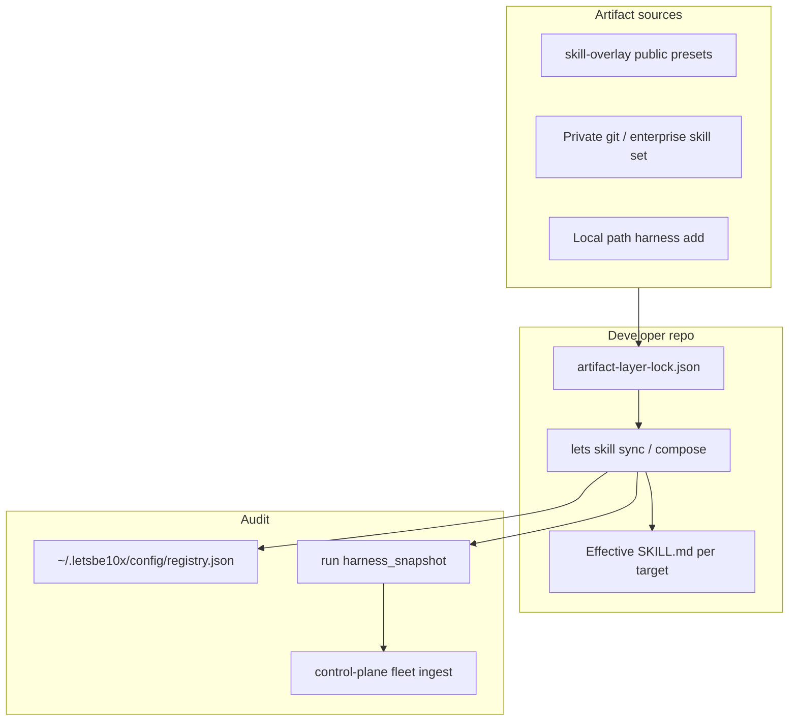

# LAEM overview

**LAEM** (Lets Artifact Extension Model) is the harness that lets teams **extend** or
**customize** agent behavior without forking core skills, while keeping an auditable
effective instruction stack.

Canonical decision: `ground-truth/decisions/decision-040-laem-artifact-harness.md`.

## Four artifact roles

| Role | You want to… | Example |
|------|----------------|---------|
| `core` | Use the shipped skill as-is | `skill:lets-develop-feature` from `skills/` |
| `extension` | Add a new capability | New `lets-jira-bridge` skill, pack slice, adapter |
| `preset` | Change behavior of existing targets | Compliance append on `lets-create-plan` |
| `override` | Repo-local experiment | `.letsbe10x/overrides/skills/...` |

**Governance presets** (`governance_preset` role) tighten org policy only — they cannot
loosen mutation policy.

## Resolution stack (highest wins)

```
override  →  preset (priority desc)  →  extension  →  core
```

Removing a layer restores the next layer down (spec-kit-style restore).

## Two mechanisms in this repository

### 1. LAEM presets (current direction)

- Directory: `profiles/lets/presets/<preset-id>/`
- Contract: `lets-artifact.manifest.json` + `compositions/*.md`
- Applied via: `lets harness add`, enterprise `harness_layers`, `lets skill sync`

### 2. Legacy overlay hooks (being migrated)

- Directory: `profiles/lets/<skill-name>/overlay.toml` + `hooks/*.md`
- Injects **pre/post** hooks around base `SKILL.md` (context, governance, kit rules)
- Applied via: `lets skill sync` composition path
- See [overlay migration](overlay-migration.md)

Do not mix paradigms in one deliverable: new work should be **presets** (or private
enterprise manifests), not new `overlay.toml` unless you are maintaining legacy until migration completes.

## Repo-local state (after `lets harness init`)

| Path | Purpose |
|------|---------|
| `.letsbe10x/artifact-layer-lock.json` | Pinned layer stack per target + effective hashes |
| `.letsbe10x/harness/artifacts/` | Installed artifact trees |
| `.letsbe10x/overrides/` | Override role material |

## Architecture diagram


