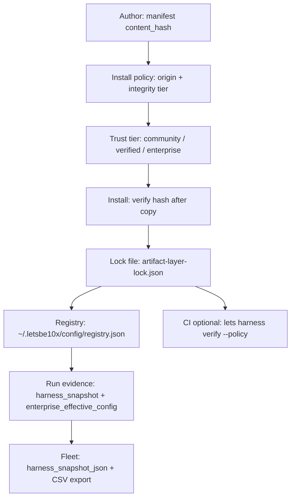

# Provenance assurance and defense in depth

Enterprise skill distribution is a **supply-chain surface**. LAEM + PRD-048 treat
provenance as mandatory metadata and verified bytes, not trust in a git host name.

## What “provenance” means here

For every installed or enforced artifact, the platform records:

| Field | Meaning |
|-------|---------|
| `artifact_id` | Stable ID (e.g. `skill:my-skill:1.0.0`, preset id) |
| `content_hash` | `sha256:` digest of installed tree or canonical skill bytes |
| `source_ref` | Git ref, file path, or enterprise bundle pointer |
| `role` | `core`, `extension`, `preset`, `override`, … |
| `priority` | Preset ordering when multiple presets target same skill |
| `publisher` | Enterprise publisher id (for quarantine) |
| `distribution.signature` | Detached Ed25519 over distribution payload (enterprise) |

## Defense-in-depth layers



### Layer 1 — Author manifest

- `lets-artifact.manifest.json` includes `distribution.content_hash`.
- Recompute after any composition or file change (`sha256_prefixed` in core harness utils).
- `forge check --harness` validates schema and anchor files.

### Layer 2 — Install policy

Three tightening layers (most specific wins):

- `LETS_ENTERPRISE_INSTALL_POLICY`
- `LETS_FEDERATION_INSTALL_POLICY`
- `LETS_INSTALL_POLICY`

Evaluated on `lets harness add` and `lets enterprise apply`. Blocks disallowed origins or integrity levels.

### Layer 3 — Trust tier

Manifest `distribution.trust_tier`:

| Tier | Typical use |
|------|-------------|
| `community` | Browse-first catalog; strictest policy |
| `verified` | Internal reviewed |
| `enterprise` | Signed org distribution |

### Layer 4 — Install-time verification

- Copy artifact tree to `.letsbe10x/harness/artifacts/`.
- Re-hash and compare to manifest / enterprise pin.
- Mismatch → install fails (fail closed).

### Layer 5 — Repo lock file

`.letsbe10x/artifact-layer-lock.json`:

- Per-target layers and `effective_hash` after composition.
- Commit to git for team audit (`lets harness verify --policy` when `LETS_HARNESS_LOCK_IN_GIT=1`).

### Layer 6 — Global provenance registry

`~/.letsbe10x/config/registry.json` (schema v2):

- Maps install destinations to source paths and **layer snapshots**.
- Used for drift detection (`harness_provenance_drift`).

### Layer 7 — Run evidence

Each run can persist:

- `harness_snapshot` on run summary (effective stack metadata).
- `runs/<id>/enterprise_effective_config.json` (policy + enterprise decisions).

### Layer 8 — Fleet ingest

Control-plane stores `repos.harness_snapshot_json` from sync ingest.

Operators:

- Fleet UI harness panel
- `GET /api/exports/harness-fleet.csv`
- `GET /api/exports/fleet.csv` (includes harness columns)

### Layer 9 — CI (recommended, not yet mandatory everywhere)

```bash
lets harness verify
lets harness verify --policy   # lock present in git when enabled
```

Org template for mandatory §14 CI gate is **pending** (PRD-048 follow-on).

## Enterprise-specific guarantees

| Control | Behavior |
|---------|----------|
| Pinned hashes | Every artifact in skill set has `content_hash` |
| Signed distribution | `distribution.signature` required on publish to CP |
| Publisher quarantine | New publishers blocked until `lets enterprise trust approve` |
| Break-glass | `lets enterprise break-glass disable <artifact_id>` — audited events |
| Lifecycle | preview → approved → enforced; rollback API |
| Harness layers | Optional `harness_layers[]` + optional `harness_layers_signature` |

## What this repo guarantees vs `core`

| Responsibility | `skill-overlay` | `core` + `control-plane` |
|----------------|-----------------|---------------------------|
| Publish first-party preset bytes | Yes | — |
| Verify on install | — | Yes |
| Enterprise lifecycle | — | control-plane API + `lets enterprise` |
| Lock + compose | — | Yes |
| Run/fleet audit | — | Yes |

Public presets in this repo must keep **`distribution.content_hash` accurate** in PRs.
CI in `skill-forge` (`forge check --harness`) catches schema and anchor errors; hash
updates are author responsibility (documented in [authoring presets](authoring-presets.md)).

## Community catalog caveat

Catalog metadata may be curated for discovery. **Catalog listing does not approve code.**
Consumers must still pass install policy and hash verification at install time.
