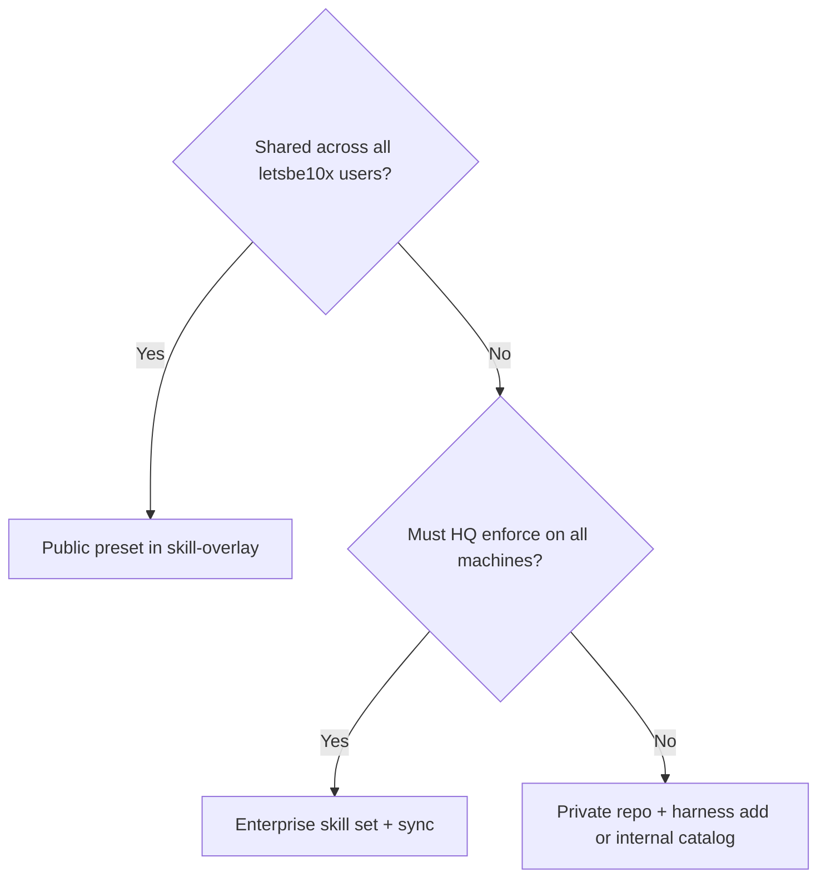

# Public, private, and org-only extensions

Where an artifact lives determines **who can see it**, **how it is discovered**, and
**how it is enforced**. The **manifest format is the same**; distribution channel differs.

## Comparison

| Dimension | Public (this repo) | Private (team) | Org-only (enterprise) |
|-----------|-------------------|----------------|------------------------|
| **Git home** | `letsbe10x/skill-overlay` | Private repository or internal artifact store | Control-plane skill-set records + optional private git |
| **Typical role** | `preset`, example `extension` | `preset`, `extension` | `artifacts[]` + `harness_layers[]` on skill set |
| **License** | MIT / open review | Company confidential | Company confidential |
| **Discovery** | Clone, path install, future catalog | Internal docs, URL, CI | `lets enterprise sync`, CP admin UI |
| **Trust tier** | `first_party` in manifest | `verified` or `enterprise` | Signed `distribution` + publisher quarantine |
| **Enforcement** | Voluntary per repo (`harness add`) | Team policy / CI | **Enforced** artifacts on skill set |
| **Must not contain** | Customer secrets, Acme-only rules | — | Ad-hoc parallel JSON skill stacks in CP |

## Public extensions (belong in `skill-overlay`)

**Include when:**

- First-party letsbe10x behavior shared across customers
- Example presets (e.g. `acme-sdlc-preset`)
- Engineering or Research Studio bundle rules used by many teams

**Shipped locations:**

- `profiles/lets/presets/<id>/` — LAEM presets
- `profiles/lets/<skill>/overlay.toml` — legacy hooks (migrate to presets)

**Workflow:**

1. Author under `profiles/lets/presets/` — see [authoring presets](authoring-presets.md).
2. Open PR to `skill-overlay`; run `forge check --harness`.
3. Consumers: `lets harness add <path-to-preset>` or bundle/sync flows.

## Private extensions (do not commit to `skill-overlay`)

**Use when:**

- Compliance text is customer-specific
- Unreleased skills or experimental presets
- Licensed third-party content

**Workflow:**

1. Same directory layout as a public preset (`lets-artifact.manifest.json`, compositions).
2. Host in **private git** or internal artifact registry.
3. Install per repo:
   ```bash
   lets harness add /path/to/private/my-preset
   ```
4. Optionally reference from an **internal** catalog entry (org `catalog.yaml`) with
   `trust_tier: verified` or `enterprise`.

Install policy (`LETS_*_INSTALL_POLICY`) controls allowed origins — configure
enterprise/federation/local policy files in `core` governance templates.

## Org-only extensions (enterprise distribution)

**Use when:**

- Security requires **central rollout** and audit
- Operators need preview → approve → enforce → rollback
- Fleet must show harness drift and effective stacks

**Workflow:**

1. Operator creates **preview** skill set (control-plane admin UI JSON or API).
2. Each artifact includes pinned `content_hash` and signed `distribution` metadata.
3. Optional `harness_layers[]` pins LAEM layers (same schema as portable bundle — do not invent a second format).
4. Approve → enforce on control-plane.
5. Developers:
   ```bash
   lets enterprise pull --out enforced.json   # inspect
   lets enterprise diff --file candidate.json # compare
   lets enterprise sync --auto-trust-publishers  # or trust publishers explicitly
   ```

See [enterprise distribution (PRD-048)](enterprise-distribution-prd-048.md).

## Choosing a channel (decision tree)



## Anti-patterns

| Anti-pattern | Why |
|--------------|-----|
| Customer PII in public preset | Wrong repo; use private or enterprise |
| Duplicate skill body in preset | Use `append`/`replace` on sections, not full fork |
| Second harness JSON format in control-plane | Use `harness_layers[]` only |
| Unsigned artifacts in enforced enterprise set | API rejects missing `distribution` |
| Bypass install policy “just once” | Breaks defense in depth; use break-glass with audit |
